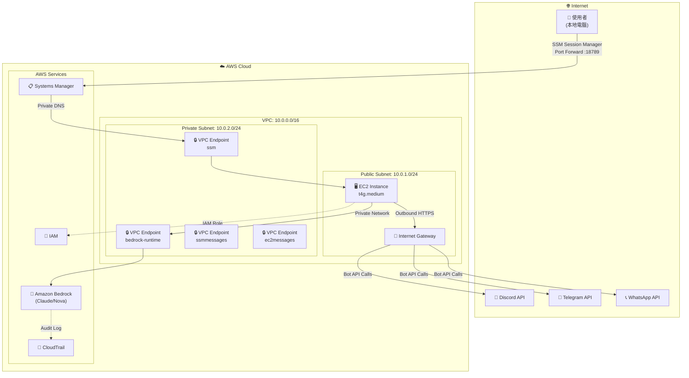
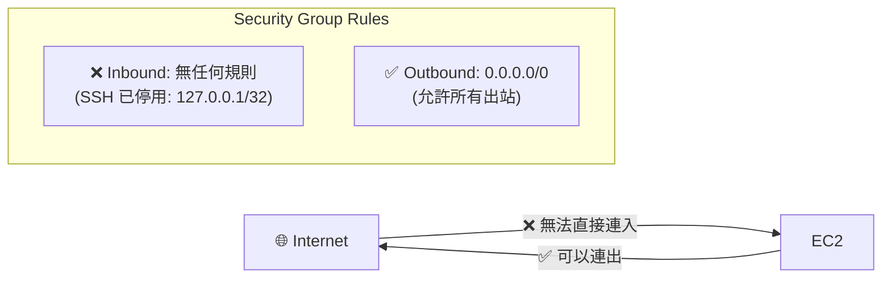
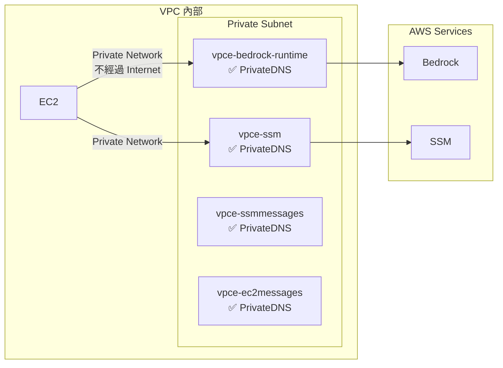
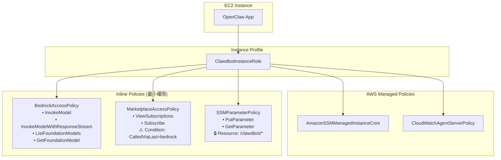
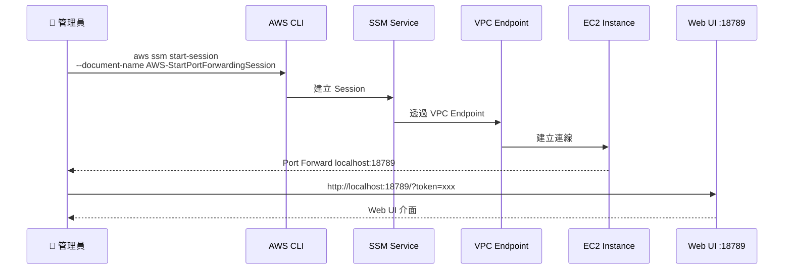
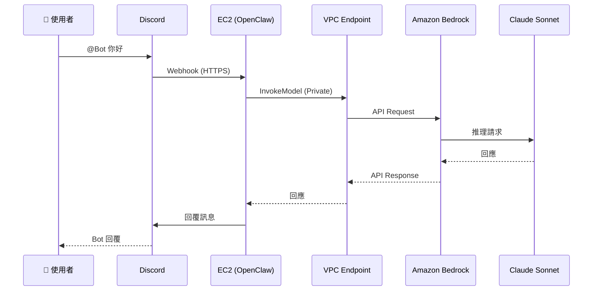

# OpenClaw on AWS 網路架構說明

本文件詳細說明 OpenClaw (Moltbot) 在 AWS 上的網路架構、安全設計和權限管理。

## 架構總覽



---

## 網路架構詳細說明

### VPC 配置

| 資源 | CIDR/設定 |
|------|----------|
| VPC | `10.0.0.0/16` |
| Public Subnet | `10.0.1.0/24` |
| Private Subnet | `10.0.2.0/24` |
| Internet Gateway | attached to VPC |

### EC2 Instance

| 屬性 | 值 |
|------|-----|
| Instance Type | `t4g.medium` (Graviton ARM) |
| Subnet | Public Subnet |
| Security Group | 無 Inbound 規則 |

---

## 網路封閉性設計

### 1. 無 Inbound 連線



**關鍵設計**：
- **SSH 已停用**：`AllowedSSHCIDR: 127.0.0.1/32` 表示沒有任何 IP 可以 SSH
- **無 Public Port**：Security Group 沒有任何 Inbound 規則
- **唯一存取方式**：SSM Session Manager（透過 VPC Endpoint）

### 2. VPC Endpoints (Private Link)

所有 AWS 服務通訊都透過 VPC Endpoints，不經過公網：



| VPC Endpoint | Service | 用途 |
|--------------|---------|------|
| bedrock-runtime | `com.amazonaws.<region>.bedrock-runtime` | AI 模型調用 |
| ssm | `com.amazonaws.<region>.ssm` | Systems Manager |
| ssmmessages | `com.amazonaws.<region>.ssmmessages` | Session Manager |
| ec2messages | `com.amazonaws.<region>.ec2messages` | EC2 訊息 |

**注意**：SSM Session Manager 需要 3 個 endpoints（ssm + ssmmessages + ec2messages）才能正常運作。

---

## 權限管理架構

### IAM Role 結構



### 權限詳細說明

#### 1. BedrockAccessPolicy

```json
{
  "Effect": "Allow",
  "Action": [
    "bedrock:InvokeModel",
    "bedrock:InvokeModelWithResponseStream",
    "bedrock:ListFoundationModels",
    "bedrock:GetFoundationModel"
  ],
  "Resource": "*"
}
```

**設計原則**：只給予調用模型所需的最小權限，不包含管理權限。

#### 2. MarketplaceAccessPolicy (第三方模型)

```json
{
  "Sid": "MarketplaceFor3pModels",
  "Effect": "Allow",
  "Action": [
    "aws-marketplace:ViewSubscriptions",
    "aws-marketplace:Subscribe"
  ],
  "Resource": "*",
  "Condition": {
    "StringEquals": {
      "aws:CalledViaLast": "bedrock.amazonaws.com"
    }
  }
}
```

**設計原則**：
- 只允許透過 Bedrock API 調用時才能使用 Marketplace 權限
- 防止直接調用 Marketplace API 訂閱其他產品

#### 3. SSMParameterPolicy

```json
{
  "Effect": "Allow",
  "Action": ["ssm:PutParameter", "ssm:GetParameter"],
  "Resource": "arn:aws:ssm:<region>:<account>:parameter/clawdbot/<stack-name>/*"
}
```

**設計原則**：限制只能存取特定路徑的 Parameter Store。

---

## 存取流程

### 管理員存取 Web UI



### AI 模型調用流程



---

## 安全特性總結

| 特性 | 實作方式 | 效果 |
|------|---------|------|
| **無公開端口** | Security Group 無 Inbound | 無法從外部直接連入 |
| **SSH 停用** | `AllowedSSHCIDR: 127.0.0.1/32` | 只能透過 SSM 存取 |
| **私有網路** | VPC Endpoints | Bedrock/SSM 流量不經公網 |
| **最小權限** | Inline Policies + Conditions | 只給必要權限 |
| **條件限制** | `aws:CalledViaLast` | Marketplace 只能透過 Bedrock 調用 |
| **資源限制** | SSM Parameter 路徑限制 | 只能存取特定 Parameter |
| **審計日誌** | CloudTrail | 所有 API 調用都有記錄 |

---

## 相關文件

- [Web UI 架構說明](./webui-ssm-architecture.md)
- [CloudFormation Template](../clawdbot-bedrock.yaml)

---

*最後更新：2026-02-05*
