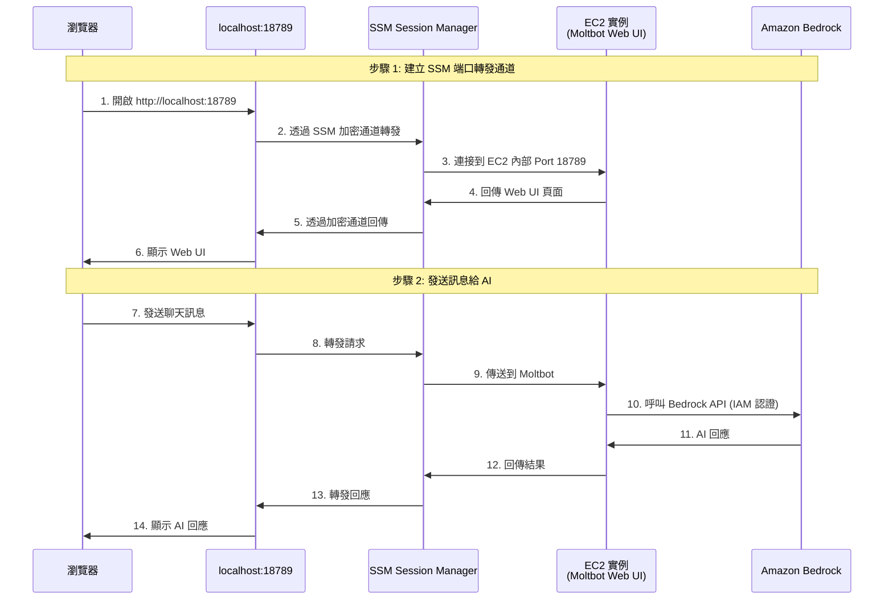
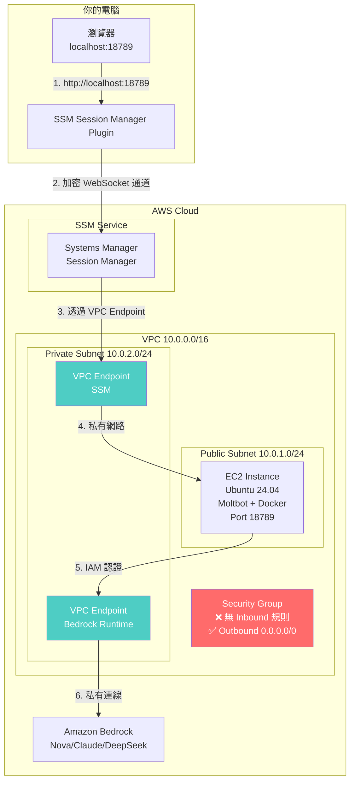
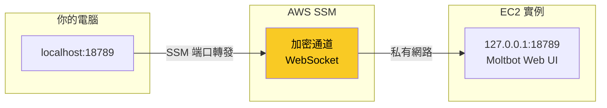
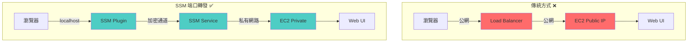
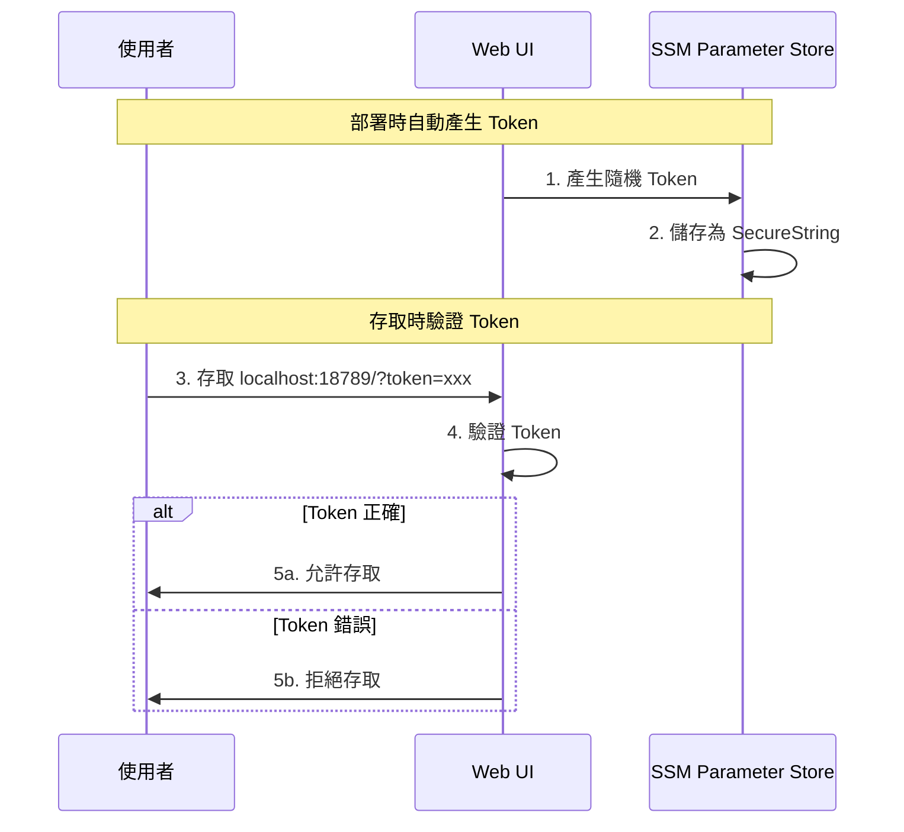
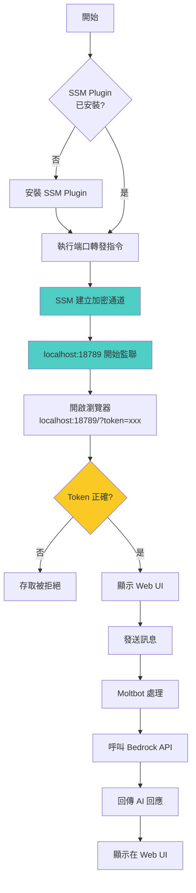

# Web UI 架構說明

## 為什麼是 localhost？

當你存取 `http://localhost:18789/?token=xxx` 時，你並不是直接連到 EC2 實例。這是透過 **SSM Session Manager 端口轉發** 實現的安全存取機制。

## 架構圖



## 網路架構圖



## 端口轉發原理



### 端口轉發指令解析

```bash
aws ssm start-session \
  --target <INSTANCE_ID> \                  # EC2 實例 ID
  --region <REGION> \                       # AWS 區域
  --document-name AWS-StartPortForwardingSession \  # SSM 文件
  --parameters '{"portNumber":["18789"],"localPortNumber":["18789"]}'
                 # EC2 上的 Port    # 你電腦上的 Port
```

這個指令做了什麼：
1. 在你的電腦上監聽 `localhost:18789`
2. 建立一個加密的 WebSocket 通道到 AWS SSM
3. SSM 將流量轉發到 EC2 實例的 Port 18789
4. 所有流量都經過加密，不需要開放任何公網端口

## 為什麼這樣設計？

### 安全優勢

| 傳統方式 | SSM 端口轉發 |
|---------|-------------|
| 開放 Security Group Inbound | ❌ 無需開放任何 Inbound |
| 需要公網 IP 或 Load Balancer | ❌ 不需要 |
| 可能被掃描和攻擊 | ✅ 完全隱藏 |
| 需要 SSL 憑證 | ✅ SSM 自動加密 |
| 需要防火牆規則 | ✅ IAM 權限控制 |

### 流量路徑比較



## Gateway Token 的作用



Token 儲存位置：
- SSM Parameter Store: `/clawdbot/<stack-name>/gateway-token`
- EC2 實例: `~/.clawdbot/gateway_token.txt`

## 完整存取流程



## 相關文件

- [AWS 網路架構說明](./aws-network-architecture.md)
- [AWS SSM Session Manager 官方文件](https://docs.aws.amazon.com/systems-manager/latest/userguide/session-manager.html)
- [SSM 端口轉發文件](https://docs.aws.amazon.com/systems-manager/latest/userguide/session-manager-working-with-sessions-start.html#sessions-start-port-forwarding)
- [Moltbot 官方文件](https://docs.molt.bot/)

## 總結

| 問題 | 答案 |
|------|------|
| 為什麼是 localhost? | SSM 端口轉發將本地端口映射到遠端 EC2 |
| 流量安全嗎? | 是，SSM 使用加密的 WebSocket 通道 |
| 需要開放防火牆嗎? | 不需要，Security Group 無 Inbound 規則 |
| Token 從哪來? | 部署時自動產生，儲存在 SSM Parameter Store |
| 為什麼不用 Load Balancer? | SSM 更安全，不暴露公網端點 |

---

*最後更新：2026-02-05*
