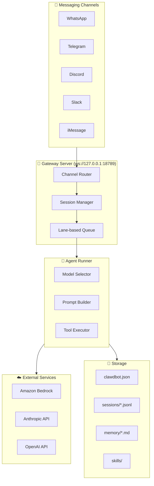
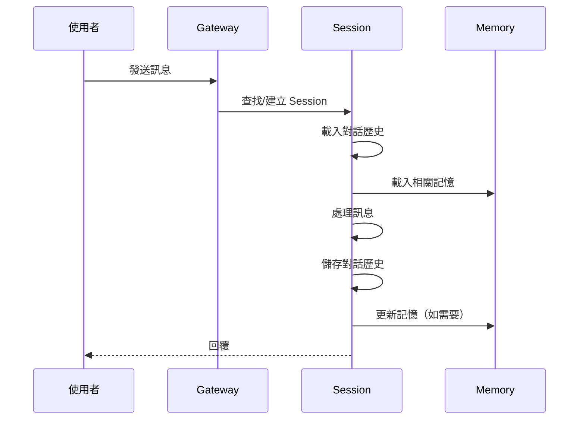
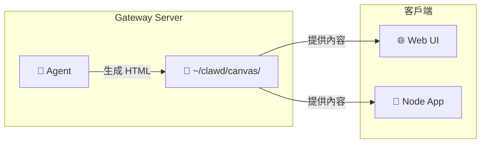
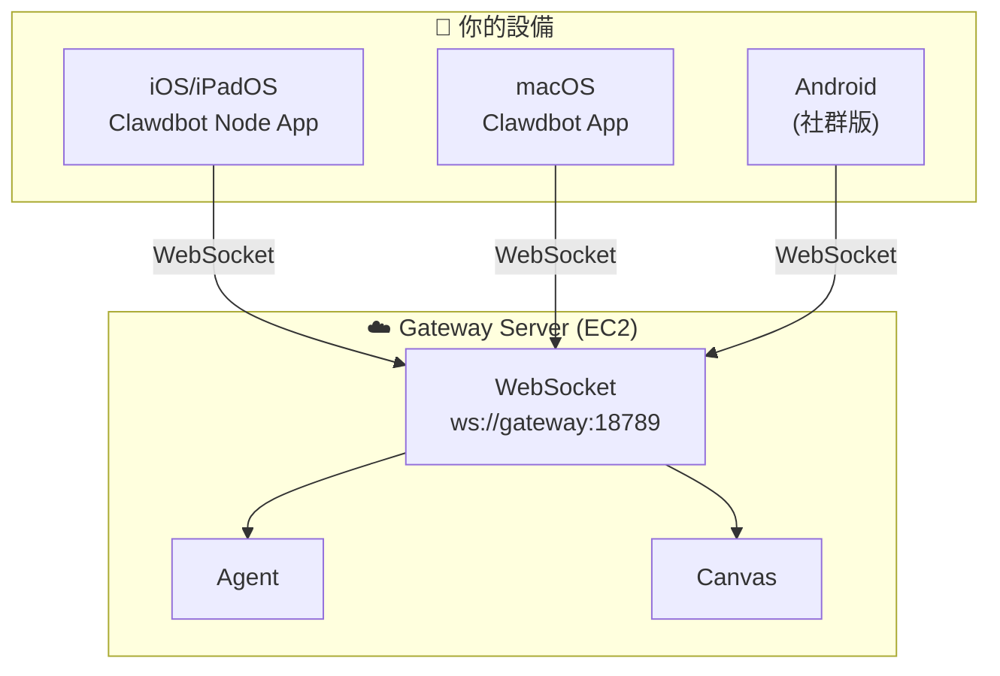
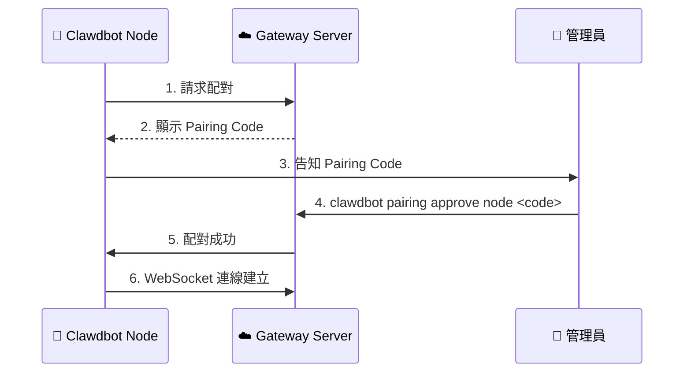

# OpenClaw 進階功能指南

本文件說明 OpenClaw (Moltbot) 的進階功能，包括 Multi-Agent 路由、Workspace 設定、Skills 系統、Session 管理等。這些功能在官方 README 中較少著墨，但對於進階使用者非常重要。

## 目錄

1. [架構概覽](#架構概覽)
2. [Agent 系統](#agent-系統)
3. [Session 管理](#session-管理)
4. [Skills 系統](#skills-系統)
5. [Memory 系統](#memory-系統)
6. [Workspace 設定](#workspace-設定)
7. [Multi-Channel 路由](#multi-channel-路由)
8. [Cron 排程任務](#cron-排程任務)
9. [Canvas 視覺化輸出](#canvas-視覺化輸出)
10. [Node 遠端控制](#node-遠端控制)
11. [安全與權限](#安全與權限)

---

## 架構概覽

### OpenClaw 核心架構



### 訊息處理流程

1. **Channel Adapter** - 接收並標準化訊息格式
2. **Gateway Server** - 路由到正確的 Session
3. **Lane-based Queue** - 管理並行請求（預設串行，可選並行）
4. **Agent Runner** - 處理 Model 選擇、Prompt 建構、Tool 執行
5. **Response** - 回傳結果到原始 Channel

---

## Agent 系統

### Agent 設定結構

```json
{
  "agents": {
    "defaults": {
      "model": {
        "primary": "amazon-bedrock/global.amazon.nova-2-lite-v1:0",
        "fallback": "amazon-bedrock/us.amazon.nova-pro-v1:0"
      },
      "compaction": {
        "mode": "safeguard"
      },
      "maxConcurrent": 4,
      "subagents": {
        "maxConcurrent": 8
      }
    }
  }
}
```

### Agent 設定選項

| 設定 | 說明 | 預設值 |
|------|------|--------|
| `model.primary` | 主要使用的 Model | - |
| `model.fallback` | 主 Model 失敗時的備用 | - |
| `compaction.mode` | 對話壓縮模式 | `safeguard` |
| `maxConcurrent` | 最大並行 Agent 數 | 4 |
| `subagents.maxConcurrent` | 子 Agent 最大並行數 | 8 |

### Compaction 模式

| 模式 | 說明 |
|------|------|
| `safeguard` | 接近 context window 上限時自動壓縮 |
| `aggressive` | 積極壓縮以節省 token |
| `none` | 不壓縮（可能導致 context overflow）|

### 切換 Model

```bash
# 查看當前 model
clawdbot config get agents.defaults.model

# 切換到 Claude Sonnet
clawdbot config set agents.defaults.model.primary "amazon-bedrock/global.anthropic.claude-sonnet-4-5-20250929-v1:0"

# 設定 fallback model
clawdbot config set agents.defaults.model.fallback "amazon-bedrock/global.amazon.nova-pro-v1:0"

# 重啟生效
clawdbot daemon restart
```

---

## Session 管理

### Session 概念

OpenClaw 使用 Session 來管理對話上下文：

- **Main Session** - 私訊（DM）使用的 Session
- **Group Session** - Server/群組頻道使用的 Session
- 每個 Session 有獨立的對話歷史和 context

### Session 儲存結構

```
~/.clawdbot/agents/main/sessions/
├── sessions.json          # Session 索引
├── <session-id>.jsonl     # 對話歷史（JSON Lines 格式）
└── ...
```

### Session 指令

**在聊天中使用：**

| 指令 | 功能 |
|------|------|
| `/status` | 顯示當前 Session 狀態（model、tokens、cost）|
| `/new` 或 `/reset` | 開始新對話（清除 context）|
| `/think high` | 啟用深度思考模式 |
| `/help` | 顯示可用指令 |

**CLI 指令：**

```bash
# 列出所有 sessions
clawdbot sessions list

# 查看特定 session
clawdbot sessions preview <session-id>

# 刪除 session
clawdbot sessions delete <session-id>

# 壓縮 session（減少 token 使用）
clawdbot sessions compact <session-id>
```

### Session 生命週期



---

## Skills 系統

### Skills 概念

Skills 是 OpenClaw 的模組化能力擴展系統。每個 Skill 是一個資料夾，包含 `SKILL.md` 檔案來定義功能。

### Skills 類型

| 類型 | 說明 | 位置 |
|------|------|------|
| **Bundled Skills** | 內建技能（50+）| 安裝目錄 |
| **Managed Skills** | 從 ClawdHub 安裝 | `~/.clawdbot/skills/` |
| **Workspace Skills** | 專案特定技能 | `./clawd/skills/` |

### 內建 Skills 範例

- **Email** - 郵件處理
- **Calendar** - 行事曆管理
- **Browser** - 網頁自動化
- **GitHub** - GitHub 整合
- **Smart Home** - 智慧家居控制
- **Voice** - 語音處理

### Skills 指令

```bash
# 列出可用 skills
clawdbot skills list

# 安裝 skill
clawdbot skills install <skill-name>

# 查看已安裝 skills
clawdbot skills installed

# 移除 skill
clawdbot skills remove <skill-name>
```

### 自訂 Skill 結構

```
my-skill/
├── SKILL.md          # 必要：技能說明和指令
├── tools/            # 可選：自訂工具
│   └── my-tool.ts
└── config.json       # 可選：設定檔
```

### SKILL.md 範例

```markdown
---
emoji: 🔧
requires:
  bins: [curl, jq]
  env: [MY_API_KEY]
---

# My Custom Skill

這個 Skill 用於...

## 使用方式

當使用者說「執行我的任務」時，執行以下步驟：
1. 檢查環境變數
2. 呼叫 API
3. 回傳結果

## 範例

- 「幫我執行任務 A」
- 「查詢 B 的狀態」
```

---

## Memory 系統

### Memory 概念

OpenClaw 使用兩層記憶系統：

1. **Session Memory** - 對話歷史（`.jsonl` 檔案）
2. **Long-term Memory** - 持久記憶（`memory/*.md` 檔案）

### Memory 儲存結構

```
~/.clawdbot/agents/main/
├── sessions/
│   └── *.jsonl           # 對話歷史
└── workspace/
    └── memory/
        ├── MEMORY.md     # 主記憶檔
        └── *.md          # 分類記憶
```

### Memory 搜尋機制

OpenClaw 使用混合搜尋：

- **Vector Search** - 語意相似度（SQLite + 向量）
- **Keyword Search** - 關鍵字匹配（FTS5）

### 使用 Memory

**讓 Agent 記住事情：**

```
你：記住我喜歡深色模式
Agent：好的，我已經記下你偏好深色模式。
```

**查詢記憶：**

```
你：我之前說過什麼偏好？
Agent：根據我的記憶，你偏好深色模式...
```

### Memory 指令

```bash
# 查看記憶檔案
cat ~/.clawdbot/agents/main/workspace/memory/MEMORY.md

# 手動編輯記憶
nano ~/.clawdbot/agents/main/workspace/memory/MEMORY.md
```

---

## Workspace 設定

### Workspace 概念

Workspace 是 OpenClaw 的工作目錄，包含專案特定的設定、Skills 和 Prompts。

### Workspace 結構

```
~/clawd/                    # 預設 Workspace
├── system.md              # 系統 Prompt（自訂 Agent 行為）
├── skills/                # Workspace Skills
│   └── my-skill/
├── memory/                # Workspace Memory
│   └── *.md
└── config.json            # Workspace 設定
```

### 自訂系統 Prompt

建立 `~/clawd/system.md`：

```markdown
你是我的個人助理。請遵循以下規則：

1. 回答要簡潔有力
2. 使用繁體中文
3. 遇到不確定的事情要先確認
4. 重要操作前要先詢問確認
```

### 多 Workspace 設定

```bash
# 設定 Workspace 路徑
clawdbot config set workspace.path "/path/to/my/workspace"

# 或使用環境變數
export CLAWDBOT_WORKSPACE="/path/to/my/workspace"
```

---

## Multi-Channel 路由

### Channel 設定

```json
{
  "channels": {
    "discord": {
      "enabled": true,
      "token": "<BOT_TOKEN>",
      "groupPolicy": "open"
    },
    "telegram": {
      "enabled": true,
      "token": "<BOT_TOKEN>"
    },
    "whatsapp": {
      "enabled": true
    }
  }
}
```

### groupPolicy 選項

| 值 | 行為 |
|---|------|
| `allowlist` | 只回應私訊 + allowlist 中的群組（預設）|
| `open` | 回應所有群組 |
| `denylist` | 回應除了 denylist 以外的所有群組 |

### 設定 Allowlist/Denylist

```bash
# 查看當前設定
clawdbot config get channels.discord

# 設定 groupPolicy
clawdbot config set channels.discord.groupPolicy allowlist

# 添加到 allowlist（需要編輯 JSON）
# 在 clawdbot.json 中：
# "channels": {
#   "discord": {
#     "allowlist": ["server-id-1", "server-id-2"]
#   }
# }
```

### 跨 Channel 對話

OpenClaw 支援跨 Channel 維持對話上下文：

```
WhatsApp: 幫我查一下明天的行程
Agent: 你明天有 3 個會議...

（稍後在 Telegram）
Telegram: 第一個會議是什麼？
Agent: 根據剛才的查詢，第一個會議是...
```

---

## Cron 排程任務

### Cron 概念

OpenClaw 支援排程任務，可以定時執行指令。

### Cron 設定

```bash
# 添加 cron job
clawdbot cron add "0 8 * * *" "每日簡報：總結行事曆和前 5 封郵件"

# 列出 cron jobs
clawdbot cron list

# 移除 cron job
clawdbot cron remove <job-id>
```

### Cron 表達式

```
┌───────────── 分鐘 (0 - 59)
│ ┌───────────── 小時 (0 - 23)
│ │ ┌───────────── 日 (1 - 31)
│ │ │ ┌───────────── 月 (1 - 12)
│ │ │ │ ┌───────────── 星期 (0 - 7, 0 和 7 都是週日)
│ │ │ │ │
* * * * *
```

### 常用範例

| 表達式 | 說明 |
|--------|------|
| `0 8 * * *` | 每天早上 8 點 |
| `0 9 * * 1` | 每週一早上 9 點 |
| `*/30 * * * *` | 每 30 分鐘 |
| `0 0 1 * *` | 每月 1 號午夜 |

### Cron 儲存位置

```
~/.clawdbot/cron/jobs.json
```

---

## Canvas 視覺化輸出

### Canvas 概念

Canvas 是 OpenClaw 的視覺化輸出功能，讓 Agent 可以生成和展示互動式 HTML 內容。Agent 可以創建圖表、報告、Dashboard 等視覺化內容，並透過 Web UI 或 Node App 查看。

### Canvas 架構



### Canvas 目錄結構

```
~/clawd/
└── canvas/
    ├── index.html        # 主要 Canvas 頁面
    ├── dashboard.html    # 自訂 Dashboard
    └── *.html            # 其他視覺化內容
```

### Canvas 用途

| 用途 | 說明 |
|------|------|
| **互動式報告** | Agent 生成的數據報告，支援互動操作 |
| **Dashboard** | 即時監控面板，顯示系統狀態 |
| **資料視覺化** | 圖表、圖形等視覺化呈現 |
| **小工具** | 時鐘、計算器等實用工具 |
| **Demo 頁面** | 展示 Agent 能力的範例 |

### Canvas 範例

以下是一個簡單的 Canvas 範例（來自實際 EC2 環境）：

```html
<!DOCTYPE html>
<html lang="zh-TW">
<head>
    <meta charset="UTF-8">
    <title>Clawdbot Canvas Demo</title>
    <style>
        body {
            font-family: -apple-system, BlinkMacSystemFont, sans-serif;
            background: linear-gradient(135deg, #667eea 0%, #764ba2 100%);
            color: white;
        }
        .card {
            background: rgba(255, 255, 255, 0.1);
            backdrop-filter: blur(10px);
            border-radius: 12px;
            padding: 30px;
        }
    </style>
</head>
<body>
    <div class="card">
        <h1>🎨 Canvas Demo</h1>
        <div id="time"></div>
        <button onclick="changeColor()">更換顏色</button>
    </div>
    <script>
        // 即時時鐘
        setInterval(() => {
            document.getElementById('time').textContent = 
                new Date().toLocaleTimeString('zh-TW');
        }, 1000);
    </script>
</body>
</html>
```

### 讓 Agent 創建 Canvas

你可以直接告訴 Agent 創建視覺化內容：

```
你：幫我創建一個顯示系統狀態的 Dashboard
Agent：好的，我會在 canvas 目錄創建一個 Dashboard...
```

Agent 會使用檔案工具在 `~/clawd/canvas/` 目錄創建 HTML 檔案。

### 查看 Canvas

1. **透過 Web UI** - 在 Gateway Dashboard 中查看
2. **透過 Node App** - 在手機/電腦上查看
3. **直接存取** - 如果有設定 HTTP 服務

---

## Node 遠端控制

### Node 概念

Clawdbot Node 是遠端控制客戶端應用程式，讓你可以從 iPhone/iPad/Mac 等設備連接到 Gateway Server，進行遠端對話和控制。

### Node 架構



### Node 功能

| 功能 | 說明 |
|------|------|
| **遠端對話** | 從手機直接與 Gateway 上的 Agent 對話 |
| **推送通知** | 收到訊息時手機會通知 |
| **多設備同步** | 多個 Node 可以連到同一個 Gateway |
| **查看 Canvas** | 在手機上查看 Agent 生成的視覺化內容 |
| **離線代理** | Gateway 24/7 運行，Node 可以隨時連入 |

### Node 配對流程



### 安裝 Node App

| 平台 | 安裝方式 |
|------|---------|
| **iOS/iPadOS** | App Store 搜尋「Clawdbot Node」 |
| **macOS** | 下載 Clawdbot macOS App |
| **其他平台** | 查看 [官方文檔](https://docs.molt.bot/) |

### 配對步驟

1. **在設備上安裝 Node App**
2. **開啟 App，輸入 Gateway 地址**
3. **App 會顯示 Pairing Code**
4. **在 Gateway 上執行批准**：
   ```bash
   clawdbot pairing approve node <PAIRING_CODE>
   ```
5. **配對成功，開始使用**

### 在 AWS 環境中使用 Node

由於 AWS 部署的 Gateway 預設只監聽 localhost（`gateway.bind: loopback`），Node 無法直接從外部連入。

**解決方案：**

**方案 A：使用 Tailscale（推薦）**

1. 在 EC2 上安裝 Tailscale
2. 在手機上安裝 Tailscale
3. 兩者加入同一個 Tailnet
4. Node App 使用 Tailscale IP 連接

```bash
# EC2 上安裝 Tailscale
curl -fsSL https://tailscale.com/install.sh | sh
sudo tailscale up
```

**方案 B：修改 Gateway 綁定（需考慮安全性）**

```bash
# 改為監聽所有介面
clawdbot config set gateway.bind "0.0.0.0"
clawdbot daemon restart
```

⚠️ **安全提醒**：直接暴露 Gateway 端口有安全風險，建議搭配 VPN 或防火牆使用。

**方案 C：SSH Tunnel**

```bash
# 在本地建立 SSH tunnel
ssh -L 18789:localhost:18789 ubuntu@<EC2_IP>
```

### 設備管理

```bash
# 查看已配對設備
cat ~/.clawdbot/devices/paired.json

# 查看待配對設備
cat ~/.clawdbot/devices/pending.json
```

### Node vs Web UI vs Messaging Channels

| 功能 | Node App | Web UI | Discord/Telegram |
|------|:--------:|:------:|:----------------:|
| 對話 | ✅ | ✅ | ✅ |
| 推送通知 | ✅ | ❌ | ✅ |
| 查看 Canvas | ✅ | ✅ | ❌ |
| 離線使用 | ❌ | ❌ | ✅ (Gateway 代理) |
| 需要配對 | ✅ | ❌ (Token) | ✅ |
| 多設備 | ✅ | ✅ | ✅ |

---

## 安全與權限

### 執行批准系統

OpenClaw 使用 allowlist 系統管理指令執行權限：

```json
// ~/.clawdbot/exec-approvals.json
{
  "agents": {
    "main": {
      "allowlist": [
        { "pattern": "/usr/bin/npm", "lastUsedAt": 1706644800 },
        { "pattern": "/opt/homebrew/bin/git", "lastUsedAt": 1706644900 }
      ]
    }
  }
}
```

### 預設允許的指令

基本指令如 `grep`、`sort`、`head`、`tail` 預設允許。

### 被阻擋的危險模式

```bash
# 以下模式會被阻擋：
npm install $(cat /etc/passwd)     # command substitution
cat file > /etc/hosts              # redirection
rm -rf / || echo "failed"          # chained operators
(sudo rm -rf /)                    # subshell
```

### 啟用 Bash Commands

```bash
# 啟用（允許 Agent 執行 shell 指令）
clawdbot config set commands.bash true

# 停用
clawdbot config set commands.bash false

clawdbot daemon restart
```

⚠️ **安全提醒**：啟用 `commands.bash` 後，Agent 可以在主機上執行 shell 指令。請確保你了解風險。

### Docker Sandbox

OpenClaw 支援在 Docker sandbox 中執行指令，提供額外的隔離層：

```bash
# 啟用 Docker sandbox
clawdbot config set exec.sandbox docker

# 停用（直接在 host 執行）
clawdbot config set exec.sandbox none
```

---

## AWS Bedrock 特定設定

### 在 AWS 環境中的最佳實踐

1. **使用 IAM Role** - 不需要 API Key
2. **VPC Endpoints** - 私有網路存取 Bedrock
3. **CloudTrail** - 自動審計日誌
4. **多 Model 策略** - Nova Lite 日常任務，Claude 複雜推理

### Model 切換策略

```bash
# 日常任務使用 Nova Lite（便宜）
clawdbot config set agents.defaults.model.primary "amazon-bedrock/global.amazon.nova-2-lite-v1:0"

# 複雜任務使用 Claude Sonnet
# 在對話中使用 /think high 或直接切換：
clawdbot config set agents.defaults.model.primary "amazon-bedrock/global.anthropic.claude-sonnet-4-5-20250929-v1:0"
```

### 成本優化建議

| 任務類型 | 建議 Model | 原因 |
|---------|-----------|------|
| 簡單問答 | Nova 2 Lite | 最便宜 |
| 日常任務 | Nova Pro | 平衡性價比 |
| 複雜推理 | Claude Sonnet | 最強能力 |
| 程式碼生成 | Claude Sonnet | 程式碼品質最佳 |

---

## 資料來源說明

### ✅ 實測驗證

以下內容來自實際 EC2 環境測試：

- `clawdbot.json` 設定結構
- `groupPolicy` 設定效果
- CLI 指令（`clawdbot config`、`clawdbot daemon`）
- Session 和 Memory 檔案結構
- Canvas 目錄結構和範例內容（`~/clawd/canvas/index.html`）
- Devices 配對檔案結構（`~/.clawdbot/devices/`）

### 📖 來自官方/社群文件

以下內容整理自官方文件和社群教程：

- Skills 系統架構（來自 [OpenClaw GitHub](https://github.com/openclaw/openclaw)）
- Memory 搜尋機制（來自 [vibecodecamp.blog](https://vibecodecamp.blog)）
- SKILL.md 格式（來自 [zenvanriel.nl](https://zenvanriel.nl)）
- Cron 功能（來自 [docs.vultr.com](https://docs.vultr.com)）
- 執行批准系統（來自 [macaron.im](https://macaron.im)）

### ⚠️ 推測/待驗證

以下內容是根據文件推測，尚未在 AWS 環境實測：

- 多 Workspace 切換的完整流程
- Docker sandbox 在 AWS 環境的設定
- 部分 Skills 的詳細設定選項
- Node App 在 AWS 環境的完整配對流程
- Tailscale 整合的詳細步驟

---

## 相關文件

- [Discord 設定指南](./discord-setup-guide.md)
- [實作補充說明](./implementation-guide-20260204-7727637.md)
- [Clawdbot 設定架構指南](./clawdbot-config-guide.md)
- [AWS 架構說明](./openclaw-on-aws-architecture.md)

---

## 外部資源

- [OpenClaw 官方 GitHub](https://github.com/openclaw/openclaw)
- [OpenClaw Docs](https://openclawdocs.com/)
- [Moltbot 官方文件](https://docs.molt.bot/)
- [Amazon Bedrock 文件](https://docs.aws.amazon.com/bedrock/)

---

*最後更新：2026-02-04*
*內容整理自官方文件、社群教程及實測結果*
