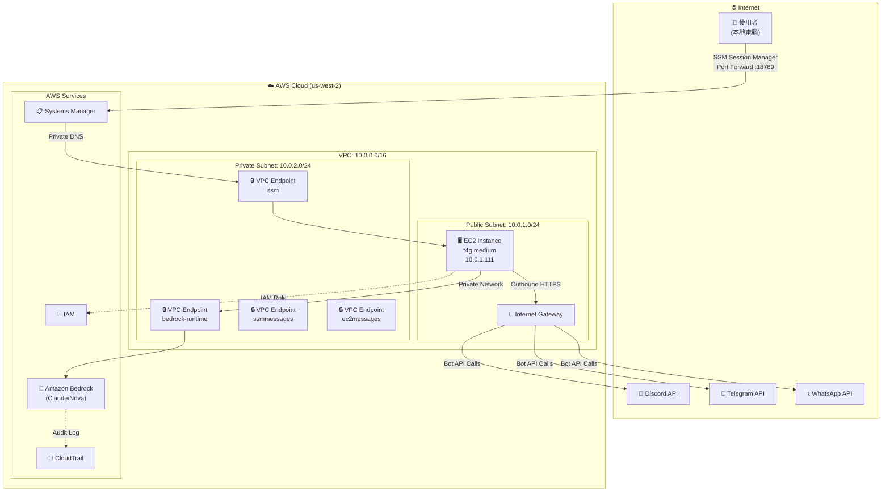
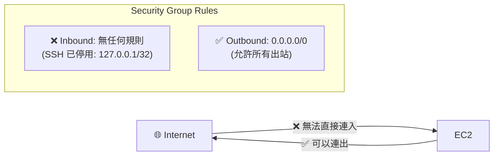
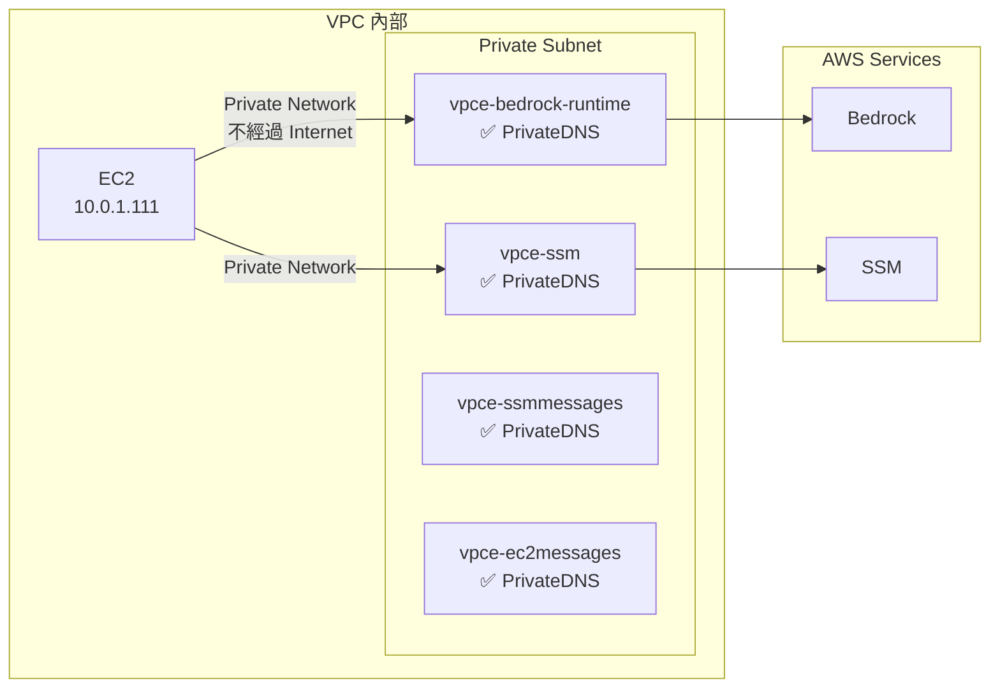
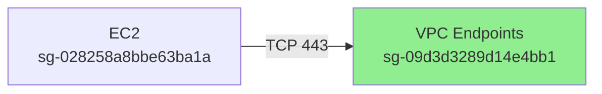
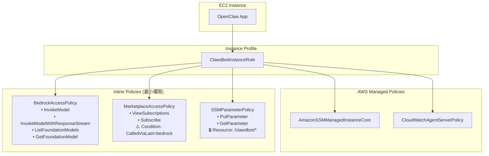
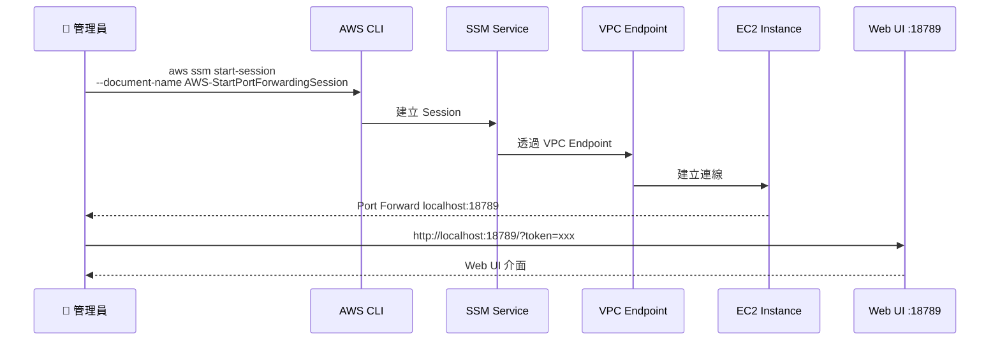
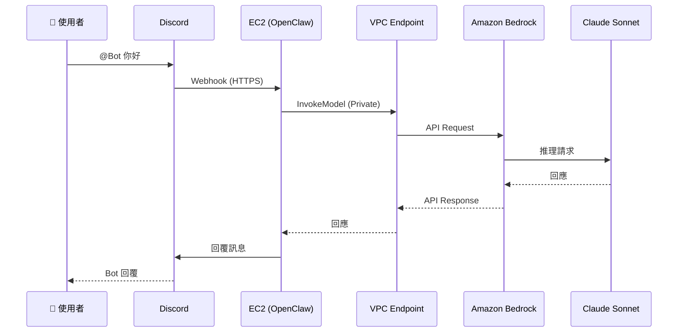

# OpenClaw on AWS 架構說明

本文件詳細說明 OpenClaw (Moltbot) 在 AWS 上的網路架構、安全設計和權限管理。

## 架構總覽



## 網路架構詳細說明

### VPC 配置

| 資源 | ID | CIDR/設定 |
|------|-----|----------|
| VPC | `vpc-073513ca1a769379d` | `10.0.0.0/16` |
| Public Subnet | `subnet-0d35ddfa3ee89a244` | `10.0.1.0/24` (us-west-2a) |
| Private Subnet | `subnet-0d671e6c6572f3ea5` | `10.0.2.0/24` (us-west-2a) |
| Internet Gateway | `igw-045734d3bb3ebc00e` | attached |

### EC2 Instance

| 屬性 | 值 |
|------|-----|
| Instance ID | `i-05c85500119de2149` |
| Instance Type | `t4g.medium` (Graviton ARM) |
| Private IP | `10.0.1.111` |
| Public IP | `54.188.231.102` |
| Subnet | Public Subnet (`10.0.1.0/24`) |
| Security Group | `sg-028258a8bbe63ba1a` |

---

## 網路封閉性設計

### 1. 無 Inbound 連線



**關鍵設計**：
- **SSH 已停用**：`AllowedSSHCIDR: 127.0.0.1/32` 表示沒有任何 IP 可以 SSH
- **無 Public Port**：Security Group 沒有任何 Inbound 規則
- **唯一存取方式**：SSM Session Manager（透過 VPC Endpoint）

### 2. VPC Endpoints (Private Link)

所有 AWS 服務通訊都透過 VPC Endpoints，不經過公網：



| VPC Endpoint | Service | 用途 |
|--------------|---------|------|
| `vpce-09b45605f8de1941d` | `bedrock-runtime` | AI 模型調用 |
| `vpce-0da336d287ef78d43` | `ssm` | Systems Manager |
| `vpce-07322bff2a39d2627` | `ssmmessages` | Session Manager |
| `vpce-0f5f308c35dca2fc7` | `ec2messages` | EC2 訊息 |

### 3. VPC Endpoint Security Group



| 規則 | 來源 | Port | 說明 |
|------|------|------|------|
| Inbound | `sg-028258a8bbe63ba1a` (EC2) | 443 | 只允許 EC2 連入 |
| Outbound | `0.0.0.0/0` | All | 允許回應 |

---

## 權限管理架構

### IAM Role 結構



### 權限詳細說明

#### 1. BedrockAccessPolicy

```json
{
  "Effect": "Allow",
  "Action": [
    "bedrock:InvokeModel",
    "bedrock:InvokeModelWithResponseStream",
    "bedrock:ListFoundationModels",
    "bedrock:GetFoundationModel"
  ],
  "Resource": "*"
}
```

**設計原則**：只給予調用模型所需的最小權限，不包含管理權限。

#### 2. MarketplaceAccessPolicy (第三方模型)

```json
{
  "Sid": "MarketplaceFor3pModels",
  "Effect": "Allow",
  "Action": [
    "aws-marketplace:ViewSubscriptions",
    "aws-marketplace:Subscribe"
  ],
  "Resource": "*",
  "Condition": {
    "StringEquals": {
      "aws:CalledViaLast": "bedrock.amazonaws.com"
    }
  }
}
```

**設計原則**：
- 只允許透過 Bedrock API 調用時才能使用 Marketplace 權限
- 防止直接調用 Marketplace API 訂閱其他產品

#### 3. SSMParameterPolicy

```json
{
  "Effect": "Allow",
  "Action": ["ssm:PutParameter", "ssm:GetParameter"],
  "Resource": "arn:aws:ssm:us-west-2:118903272200:parameter/clawdbot/moltbot-bedrock/*"
}
```

**設計原則**：限制只能存取特定路徑的 Parameter Store。

---

## 存取流程

### 管理員存取 Web UI



### AI 模型調用流程



---

## 安全特性總結

| 特性 | 實作方式 | 效果 |
|------|---------|------|
| **無公開端口** | Security Group 無 Inbound | 無法從外部直接連入 |
| **SSH 停用** | `AllowedSSHCIDR: 127.0.0.1/32` | 只能透過 SSM 存取 |
| **私有網路** | VPC Endpoints | Bedrock/SSM 流量不經公網 |
| **最小權限** | Inline Policies + Conditions | 只給必要權限 |
| **條件限制** | `aws:CalledViaLast` | Marketplace 只能透過 Bedrock 調用 |
| **資源限制** | SSM Parameter 路徑限制 | 只能存取特定 Parameter |
| **審計日誌** | CloudTrail | 所有 API 調用都有記錄 |

---

## 實際部署資訊

| 項目 | 值 |
|------|-----|
| AWS Account | `118903272200` |
| Region | `us-west-2` |
| Stack Name | `moltbot-bedrock` |
| VPC ID | `vpc-073513ca1a769379d` |
| Instance ID | `i-05c85500119de2149` |
| IAM Role | `moltbot-bedrock-ClawdbotInstanceRole-HuZ5NsYkprUG` |

---

## 資料來源說明

### ✅ 實測驗證

本文件所有資訊來自以下 AWS CLI 查詢：

- `aws ec2 describe-vpcs`
- `aws ec2 describe-subnets`
- `aws ec2 describe-vpc-endpoints`
- `aws ec2 describe-security-groups`
- `aws ec2 describe-instances`
- `aws ec2 describe-route-tables`
- `aws iam list-role-policies`
- `aws iam get-role-policy`
- `aws iam list-attached-role-policies`

### 📖 來自 CloudFormation

- `clawdbot-bedrock.yaml` 模板定義

---

*最後更新：2026-02-04*
*基於 Stack: moltbot-bedrock 實際部署狀態*
